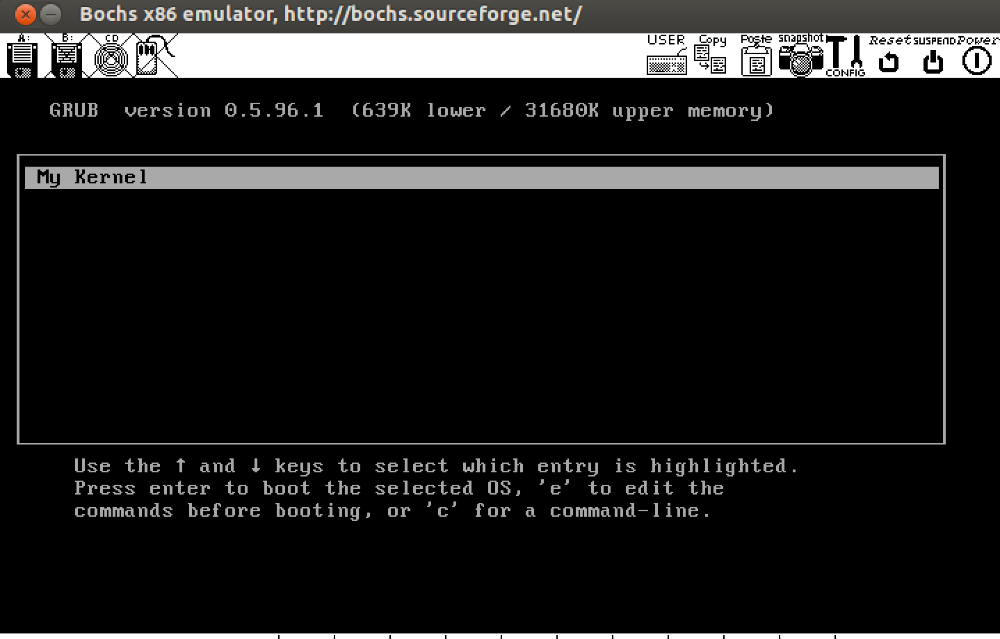
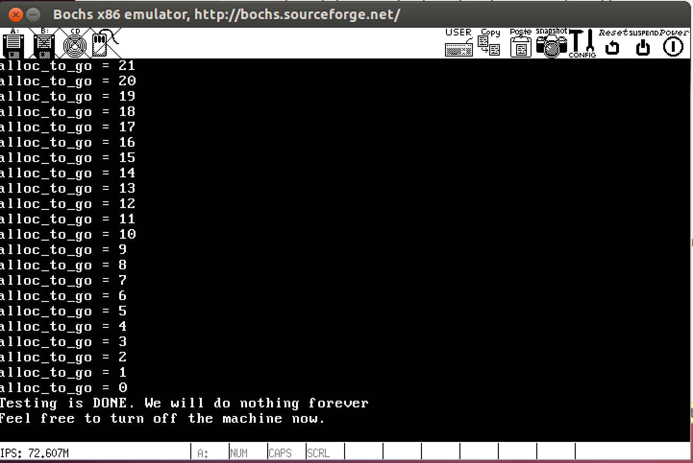

This file describes the content of this directory.
A file marked with (\*) may be of some interest to the 
student, and he/she may want to have a look at it.
A file marked with (\**) is important for this MP, and the
student is strongly encouraged to study the contents of this file.

BOCH Environment:
=================

FILE: 			DESCRIPTION:

BIOS-bochs-latest	BIOS file.
VGABIOS-lgpl-latest	BIOS file for the graphics system.
dev_kernel_grub.img	Image file of the boot floopy.
bochsrc.bxrc		Description file for the system. 
			Type 'bochs -f bochsrc.bxrc' to
			start emulation.

COMPILATION:
===========

FILE: 			DESCRIPTION:

makefile (**)		Makefile for Linux 64-bit environment.
	 		Works with the provided linux image. 
		        Type "make" to create the kernel.
linker.ld		The linker script.

OS COMPONENTS:
=============

FILE: 	&nbsp;&nbsp;&nbsp;&nbsp; DESCRIPTION:

start.asm (\*)	&nbsp;&nbsp;&nbsp;&nbsp;	The bootloader starts code in this file, which in turn jumps to the main entry in File "kernel.C".

kernel.C (\**)	&nbsp;&nbsp;&nbsp;&nbsp;	Main file, where the OS components are set up, and the
                        system gets going.

assert.H/C	&nbsp;&nbsp;&nbsp;&nbsp;	Implements the "assert()" utility.
utils.H/C	&nbsp;&nbsp;&nbsp;&nbsp;	Various utilities (e.g. memcpy, strlen, etc..)

console.H/C	&nbsp;&nbsp;&nbsp;&nbsp;	Routines to print to the screen.

machine.H/C (\*)	&nbsp;&nbsp;&nbsp;&nbsp;	Definitions of some system constants and low-level
			machine operations. 
			(Primarily memory sizes, register set, and
                        enable/disable interrupts, I/O ports)

machine\_low.H/asm   &nbsp;&nbsp;&nbsp;&nbsp;    Low-level machine operations (only status register
                        at this point)

simple\_frame\_pool.H/C (\**) &nbsp;&nbsp;&nbsp;&nbsp;  Definition and partial implementation of a vanilla physical frame memory manager that does NOT support contiguous allocation. THESE FILES ARE NOT USED IN THE CODE and are only present to provide an example implementation of a bitmap with associated bit-manipulation operations.

cont\_frame\_pool.H/C(\**) &nbsp;&nbsp;&nbsp;&nbsp; Definition and empty implementation of a physical frame memory manager that DOES support contiguous allocation. NOTE that the comments in the implementation file give a recipe of how to implement such a frame pool.
				 

UTILITIES:
==========

FILE: 			DESCRIPTION:

copykernel.sh (**)	Simple script to copy the kernel onto the floppy image. The script mounts the floppy image, copies the kernel image onto it, and then unmounts the floppy image again. In rare cases the paths in the file may need to be 
edited to make them reflect the student's environment.


RUN IN BOCHS:
==========
The programs runs in ```	Ubuntu 12.04.1 LTS ```. <br>
To run it in BOCHS environment, you have to do the following steps:

```
make		// This is to run the make file
.\copykernel.sh	//This is to mount the kernel image to floppy
bochs -f bochsrc.bxrc   //To run it in bochs
```

After it runs successfully, the screenshots of the program should be like this:


